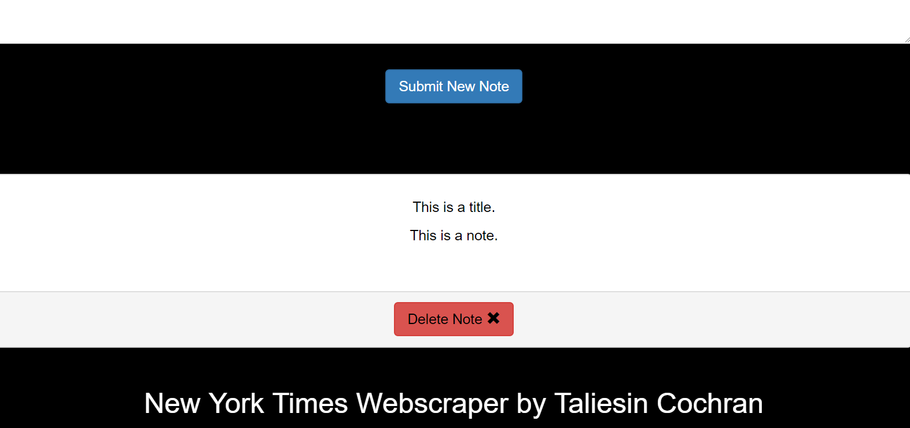

#Mongo React New York Times Web Scraper
Welcome to my New York Times Webscraper, made with mongo, react, express and node.
 
This scraper uses cheerio and axios to take all the latest headlines from the New York Times.  
 
It will save all articles in a Mongo database.  You can save or delete the items that have been scraped.  
 
Once an article is saved, you can add notes to that article. 
  
You can then review or delete your notes.
  
To use this yourself, you must have yarn installed. Clone the repo and do an yarn install. Then just open up mongod and mongo and type yarn start to start the servers.  Enjoy.
